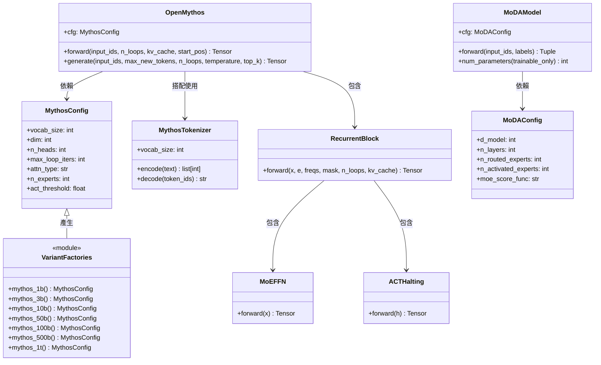

# OpenMythos API 參考文件

> 文件日期：2026-04-23
> 涵蓋模組：`open_mythos`（主架構）、`open_mythos.moda`（替代架構）

---

## 1. 公開 API 總覽

以下所有符號均可從頂層套件直接匯入（`from open_mythos import ...`）。

| 符號 | 類型 | Import 路徑 |
|---|---|---|
| `OpenMythos` | class | `from open_mythos import OpenMythos` |
| `MythosConfig` | dataclass | `from open_mythos import MythosConfig` |
| `MythosTokenizer` | class | `from open_mythos import MythosTokenizer` |
| `RMSNorm` | class | `from open_mythos import RMSNorm` |
| `GQAttention` | class | `from open_mythos import GQAttention` |
| `MLAttention` | class | `from open_mythos import MLAttention` |
| `Expert` | class | `from open_mythos import Expert` |
| `MoEFFN` | class | `from open_mythos import MoEFFN` |
| `LoRAAdapter` | class | `from open_mythos import LoRAAdapter` |
| `TransformerBlock` | class | `from open_mythos import TransformerBlock` |
| `LTIInjection` | class | `from open_mythos import LTIInjection` |
| `ACTHalting` | class | `from open_mythos import ACTHalting` |
| `RecurrentBlock` | class | `from open_mythos import RecurrentBlock` |
| `precompute_rope_freqs` | function | `from open_mythos import precompute_rope_freqs` |
| `apply_rope` | function | `from open_mythos import apply_rope` |
| `loop_index_embedding` | function | `from open_mythos import loop_index_embedding` |
| `mythos_1b` | function | `from open_mythos import mythos_1b` |
| `mythos_3b` | function | `from open_mythos import mythos_3b` |
| `mythos_10b` | function | `from open_mythos import mythos_10b` |
| `mythos_50b` | function | `from open_mythos import mythos_50b` |
| `mythos_100b` | function | `from open_mythos import mythos_100b` |
| `mythos_500b` | function | `from open_mythos import mythos_500b` |
| `mythos_1t` | function | `from open_mythos import mythos_1t` |
| `load_tokenizer` | function | `from open_mythos import load_tokenizer` ⚠️ 未實作 |
| `get_vocab_size` | function | `from open_mythos import get_vocab_size` ⚠️ 未實作 |
| `MoDAModel` | class | `from open_mythos.moda import MoDAModel` |
| `MoDAConfig` | dataclass | `from open_mythos.moda import MoDAConfig` |

---

## 2. OpenMythos class

`OpenMythos` 是主架構的核心，繼承自 `torch.nn.Module`，實作了 Recurrent-Depth Transformer（RDT）。

計算流程：
```
Input tokens → [Prelude] → [Recurrent Block × T 次] → [Coda] → Output logits
```
- **Prelude**：`prelude_layers` 個標準 TransformerBlock，只執行一次
- **Recurrent Block**：單一 TransformerBlock 循環 T 次，每次注入輸入編碼 `e`
- **Coda**：`coda_layers` 個標準 TransformerBlock，只執行一次
- Weight tying：embedding 層與 `lm_head` 共享同一份參數

### `__init__(cfg: MythosConfig)`

建構時依序完成：
1. 建立 token embedding（`nn.Embedding`）
2. 為 GQA 與 MLA 分別預先計算 RoPE 頻率並以 buffer 登記
3. 建立 `prelude`、`recurrent`、`coda` 模組列表
4. 建立 RMSNorm 與 weight-tied LM head
5. 以 `N(0, 0.02)` 初始化所有 Linear 和 Embedding 權重

```python
from open_mythos import OpenMythos, MythosConfig

cfg = MythosConfig(dim=2048, n_heads=16, vocab_size=32000)
model = OpenMythos(cfg)
```

---

### `forward(input_ids, n_loops, kv_cache, start_pos)`

執行完整前向傳遞（Prelude → Recurrent Block → Coda）。

| 參數 | 類型 | 預設值 | 說明 |
|---|---|---|---|
| `input_ids` | `torch.Tensor` | 必填 | Token 索引，shape `(B, T)` |
| `n_loops` | `Optional[int]` | `None`（使用 `cfg.max_loop_iters`）| 循環層數；推論時可超過訓練值以提升推理深度 |
| `kv_cache` | `Optional[dict]` | `None` | 傳入空字典 `{}` 並跨步驟重用以啟用自回歸 KV 快取；函式會原地修改 |
| `start_pos` | `int` | `0` | 當前 `input_ids` 在完整序列中的起始位置；prefill 階段為 `0`，後續每步為 `prompt_len + step - 1` |

**回傳值**：`torch.Tensor`，shape `(B, T, vocab_size)`，為每個位置的原始 logits。

```python
import torch
from open_mythos import OpenMythos, mythos_1b

model = OpenMythos(mythos_1b())
input_ids = torch.randint(0, 32000, (1, 16))  # batch=1, seq_len=16

# 標準前向傳遞
logits = model.forward(input_ids)               # shape: (1, 16, 32000)

# 使用 KV cache 的自回歸解碼
kv_cache = {}
logits_prefill = model.forward(input_ids, kv_cache=kv_cache, start_pos=0)
next_token = torch.tensor([[42]])
logits_step = model.forward(next_token, kv_cache=kv_cache, start_pos=16)

# 增加推理深度（depth extrapolation）
logits_deep = model.forward(input_ids, n_loops=32)  # 訓練時可能只有 16 loops
```

---

### `generate(input_ids, max_new_tokens, n_loops, temperature, top_k)`

帶 KV cache 的自回歸生成。步驟 0 處理完整 prompt，後續步驟僅傳入最後一個 token，透過 KV cache 重用之前所有 key/value。

| 參數 | 類型 | 預設值 | 說明 |
|---|---|---|---|
| `input_ids` | `torch.Tensor` | 必填 | Prompt token 索引，shape `(B, T)` |
| `max_new_tokens` | `int` | `64` | 要生成的新 token 數量 |
| `n_loops` | `int` | `8` | 每個解碼步驟的循環層數；可高於訓練值以強化推理 |
| `temperature` | `float` | `1.0` | Softmax 溫度；越低越貪婪，越高越隨機 |
| `top_k` | `int` | `50` | 只從機率最高的 K 個 token 中取樣；`0` 代表停用 |

**回傳值**：`torch.Tensor`，shape `(B, T + max_new_tokens)`，為 prompt 加上生成 token 的完整序列。

> 此方法以 `@torch.no_grad()` 裝飾，推論時不建立計算圖。

```python
import torch
from open_mythos import OpenMythos, MythosTokenizer, mythos_1b

model = OpenMythos(mythos_1b()).eval()
tok = MythosTokenizer()

prompt_ids = torch.tensor([tok.encode("從前有座山，")])  # shape: (1, N)

output_ids = model.generate(
    prompt_ids,
    max_new_tokens=128,
    n_loops=16,       # 可超過訓練值以提升推理品質
    temperature=0.8,
    top_k=40,
)
print(tok.decode(output_ids[0].tolist()))
```

---

## 3. MythosConfig 常用欄位

`MythosConfig` 是一個 Python `dataclass`，所有欄位皆有預設值。

| 欄位 | 類型 | 預設值 | 說明 |
|---|---|---|---|
| `vocab_size` | `int` | `32000` | Token 詞彙表大小 |
| `dim` | `int` | `2048` | 模型隱藏維度（hidden dimension） |
| `n_heads` | `int` | `16` | Query 注意力頭數 |
| `n_kv_heads` | `int` | `4` | Key/Value 頭數（GQA 模式使用；MLA 模式忽略此值） |
| `max_seq_len` | `int` | `4096` | RoPE 預計算的最大序列長度 |
| `max_loop_iters` | `int` | `16` | 推論時循環塊的預設迭代次數 T |
| `attn_type` | `str` | `"mla"` | 注意力機制類型：`"gqa"`（Grouped Query Attention）或 `"mla"`（Multi-Latent Attention） |
| `n_experts` | `int` | `64` | MoE FFN 中路由專家的總數 |
| `n_experts_per_tok` | `int` | `4` | 每個 token 選取的 top-K 專家數 |
| `act_threshold` | `float` | `0.99` | ACT 提早停止的累積機率閾值（達到此值後停止循環） |

---

## 4. Variants 工廠函式

所有函式定義於 `open_mythos/variants.py`，直接回傳已設定好的 `MythosConfig`。

```python
from open_mythos import mythos_10b
cfg = mythos_10b()
model = OpenMythos(cfg)
```

| 函式 | dim | 專家數（n_experts） | Loop 次數（max_loop_iters） | 適用情境 |
|---|---|---|---|---|
| `mythos_1b()` | 2048 | 64 | 16 | 小型研究 / 微調（fine-tuning） |
| `mythos_3b()` | 3072 | 64 | 16 | 精簡推論模型 |
| `mythos_10b()` | 4096 | 128 | 24 | 中型通用模型，8k context |
| `mythos_50b()` | 6144 | 256 | 32 | 大型推理模型，8k context |
| `mythos_100b()` | 8192 | 256 | 32 | 前沿等級，1M context，128k 輸出 |
| `mythos_500b()` | 12288 | 512 | 48 | 超大規模 MoE，1M context，128k 輸出 |
| `mythos_1t()` | 16384 | 512 | 64 | 最大規模，1M context，128k 輸出 |

---

## 5. MythosTokenizer

`MythosTokenizer` 封裝 HuggingFace `AutoTokenizer`，預設使用 `"openai/gpt-oss-20b"` 作為 tokenizer 來源。

```python
from open_mythos import MythosTokenizer

tok = MythosTokenizer()                        # 預設模型
tok_custom = MythosTokenizer("meta-llama/Llama-2-7b-hf")  # 自訂模型
```

### `encode(text: str) -> list[int]`

將輸入文字轉換為 token ID 列表（`add_special_tokens=False`）。

```python
ids = tok.encode("Hello, world!")
# 回傳: [15339, 11, 1917, 0]  （實際數值依 tokenizer 而定）
```

### `decode(token_ids: list[int]) -> str`

將 token ID 列表還原為文字字串（`skip_special_tokens=True`）。

```python
text = tok.decode([15339, 11, 1917, 0])
# 回傳: "Hello, world!"
```

### `vocab_size` 屬性

唯讀屬性，回傳 tokenizer 詞彙表大小（`int`）。

```python
print(tok.vocab_size)   # 例如：50257
```

---

## 6. ⚠️ 已知損壞的 API

`open_mythos/__init__.py` 的 `__all__` 列表匯出了以下兩個符號，但這兩個符號**並未在任何模組中實作**：

| 符號 | 狀態 | 說明 |
|---|---|---|
| `load_tokenizer` | ⚠️ 未實作 | 匯出名稱存在，但找不到對應的函式定義 |
| `get_vocab_size` | ⚠️ 未實作 | 匯出名稱存在，但找不到對應的函式定義 |

**影響**：執行 `from open_mythos import load_tokenizer` 時，Python 匯入不會立即報錯（因為 `__all__` 僅影響 `from package import *`），但嘗試呼叫這兩個函式時將引發 `NameError` 或 `ImportError`。

**建議替代方案**：

```python
# 替代 load_tokenizer
from open_mythos import MythosTokenizer
tok = MythosTokenizer("openai/gpt-oss-20b")

# 替代 get_vocab_size
print(tok.vocab_size)
```

---

## 7. MoDAModel（替代架構）

`MoDAModel` 定義於 `open_mythos/moda.py`，是**獨立於** `OpenMythos` 的替代架構，融合了兩項技術：

- **Mixture-of-Depths Attention（MoDA）**：每個注意力頭在單一 softmax 下同時關注當前層的序列 KV 以及前層的深度 KV
- **DeepSeek MoE FFN**：結合永遠啟動的共享專家（shared experts）和稀疏路由專家（routed experts）

```python
from open_mythos.moda import MoDAModel, MoDAConfig

cfg = MoDAConfig(
    vocab_size=32000,
    d_model=2048,
    n_layers=24,
    n_heads_q=16,
    n_heads_kv=8,
    n_routed_experts=64,
    n_activated_experts=6,
)
model = MoDAModel(cfg)

# 推論（不計算 loss）
input_ids = torch.randint(0, 32000, (1, 128))
logits, loss = model(input_ids)          # loss 為 None

# 訓練（計算 LM loss + 專家平衡 loss）
labels = input_ids.clone()
logits, loss = model(input_ids, labels=labels)
loss.backward()
```

### `MoDAModel.forward(input_ids, labels)`

| 參數 | 類型 | 預設值 | 說明 |
|---|---|---|---|
| `input_ids` | `torch.Tensor` | 必填 | Token 索引，shape `(B, T)`；T 不可超過 `cfg.max_seq_len` |
| `labels` | `Optional[torch.Tensor]` | `None` | LM 訓練目標，shape `(B, T)`；`-100` 位置被忽略 |

**回傳值**：`Tuple[torch.Tensor, Optional[torch.Tensor]]`
- `logits`：shape `(B, T, vocab_size)`
- `loss`：訓練時為 `lm_loss + moe_balance_alpha × mean(balance_losses)`，推論時為 `None`

### `MoDAModel.num_parameters(trainable_only=False)`

```python
print(f"總參數量：{model.num_parameters():,}")
print(f"可訓練參數量：{model.num_parameters(trainable_only=True):,}")
```

### MoDAConfig 主要欄位

| 欄位 | 類型 | 預設值 | 說明 |
|---|---|---|---|
| `d_model` | `int` | `2048` | 隱藏維度（須等於 `n_heads_q × head_dim`） |
| `n_layers` | `int` | `24` | Transformer block 數量 |
| `n_heads_q` | `int` | `16` | Query 頭數 |
| `n_heads_kv` | `int` | `8` | Key/Value 頭數（須整除 `n_heads_q`） |
| `n_routed_experts` | `int` | `64` | 路由專家池大小 N_r |
| `n_activated_experts` | `int` | `6` | 每個 token 選取的 top-K 專家數 K' |
| `moe_balance_alpha` | `float` | `0.001` | 專家平衡 loss 的權重（`0.0` 停用） |
| `moe_score_func` | `str` | `"softmax"` | 路由分數函數：`"softmax"` 或 `"sigmoid"`（V3 風格） |

---

## 8. 主要 API 關係圖


