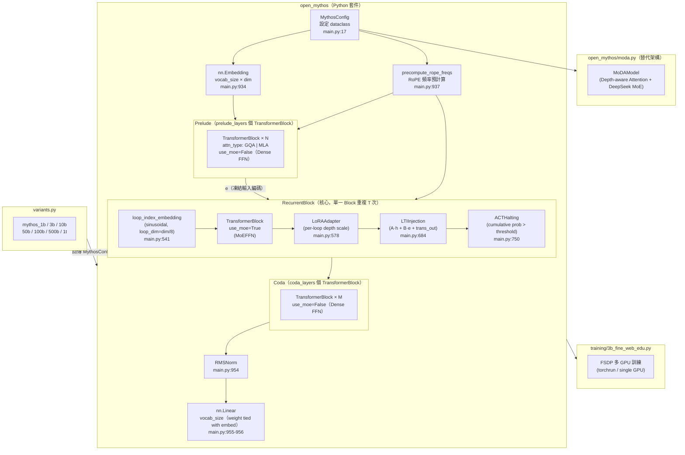
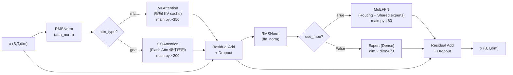
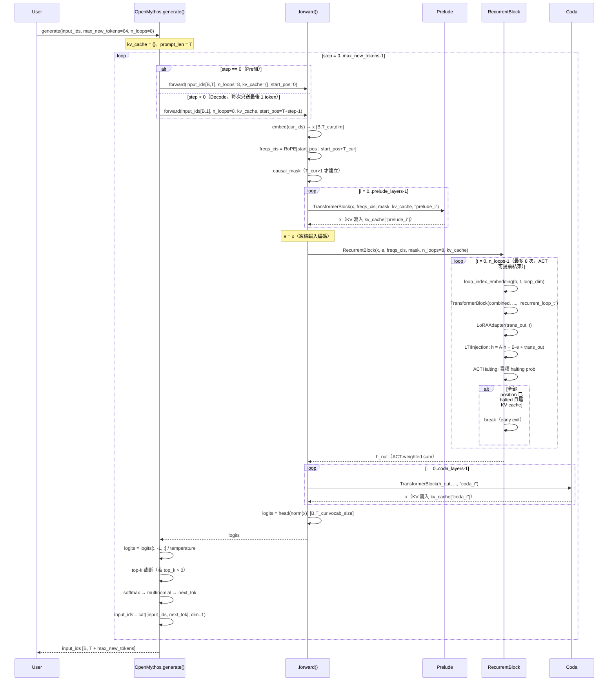

# OpenMythos 系統架構文件

> **版本**：2026-04-23
> **重要免責聲明**：OpenMythos 是社群驅動的推測性重建，並非 Anthropic 官方實作或洩漏。

---

## 1. 高層架構概觀

OpenMythos 是一個純 PyTorch 函式庫，對 Anthropic Claude Mythos 模型的疑似架構進行理論性重建。核心創新是將 **Recurrent-Depth Transformer (RDT)** 與 **Mixture-of-Experts (MoE)**、**Multi-Latent Attention (MLA)** 結合，並以 **LTI 穩定機制** 解決 looped transformer 訓練不穩定的問題。

### 1.1 整體系統架構圖



### 1.2 TransformerBlock 內部結構



---

## 2. 元件清單

| 元件 | 職責 | 關鍵檔案/行號 | 上游依賴 | 下游依賴 |
|------|------|--------------|----------|----------|
| `MythosConfig` | 所有超參數的 dataclass，是模型建構的唯一設定源 | `main.py:17` | 無 | 所有模組 |
| `OpenMythos` | 頂層 `nn.Module`，Prelude → Recurrent → Coda 串接 | `main.py:899` | `MythosConfig` | 使用者 / 訓練腳本 |
| `Prelude` | `prelude_layers` 個標準 TransformerBlock，產生凍結編碼 `e` | `main.py:946` | `TransformerBlock` | `RecurrentBlock` |
| `RecurrentBlock` | 單一 TransformerBlock 重複 `n_loops` 次的核心 loop | `main.py:788` | `TransformerBlock`, `LTIInjection`, `ACTHalting`, `LoRAAdapter` | `Coda` |
| `Coda` | `coda_layers` 個標準 TransformerBlock，精煉 loop 輸出 | `main.py:950` | `TransformerBlock` | `RMSNorm`, `head` |
| `TransformerBlock` | Attention + FFN 的單一 Transformer 層，支援 MoE/Dense 及 GQA/MLA 切換 | `main.py:638` | `RMSNorm`, `GQAttention`/`MLAttention`, `Expert`/`MoEFFN` | `Prelude`, `Coda`, `RecurrentBlock` |
| `GQAttention` | Grouped Query Attention，n_kv_heads < n_heads，支援 Flash Attn | `main.py:~200` | `RMSNorm`, RoPE freqs | `TransformerBlock` |
| `MLAttention` | Multi-Latent Attention，壓縮 KV cache 到 kv_lora_rank 維度 | `main.py:~350` | `RMSNorm`, RoPE freqs | `TransformerBlock` |
| `MoEFFN` | Top-K 路由 MoE FFN，含 shared experts + aux-loss-free bias load balancing | `main.py:460` | `Expert` | `TransformerBlock`（RecurrentBlock 中） |
| `Expert` | 單一 Dense FFN（SwiGLU 變體）；Dense FFN 與 MoE 的基本單元 | `main.py:~430` | 無 | `TransformerBlock`, `MoEFFN` |
| `LTIInjection` | 以 ZOH 離散化負對角矩陣保證 ρ(A)<1 的 LTI 穩定狀態更新 | `main.py:684` | 無 | `RecurrentBlock` |
| `ACTHalting` | 自適應計算時間：累積 halting probability，提前終止 loop | `main.py:750` | 無 | `RecurrentBlock` |
| `LoRAAdapter` | Per-loop depth-wise LoRA，以 scale Embedding 讓共享 weights 在各 loop 深度表現不同 | `main.py:578` | 無 | `RecurrentBlock` |
| `RMSNorm` | Root Mean Square Layer Normalization | `main.py:~100` | 無 | 所有需要正規化的層 |
| `MythosTokenizer` | HuggingFace tokenizer 的封裝，提供 encode/decode/vocab_size | `tokenizer.py` | `transformers` | 訓練腳本、使用者 |
| `MoDAModel` | 替代架構：MoDA Depth-aware Attention + DeepSeek MoE（獨立，不繼承 OpenMythos） | `moda.py:~900` | `MoDAConfig` | 獨立使用 |

---

## 3. 分層設計與 Module Boundary

### 3.1 三段式前饋架構（Prelude / RecurrentBlock / Coda）

```
[Input Tokens]
      │
      ▼
┌─────────────────────────────────┐
│  PRELUDE（main.py:946）         │
│  prelude_layers 個 TransBlock   │
│  use_moe=False，Dense FFN       │
│  → 產生高品質的輸入編碼 e       │
└────────────────┬────────────────┘
                 │ e（凍結，每 loop 步驟注入）
                 ▼
┌─────────────────────────────────┐
│  RECURRENT BLOCK（main.py:788） │
│  單一 TransBlock，loop T 次      │
│  use_moe=True，MoEFFN           │
│  含 LTIInjection + ACTHalting   │
│  含 LoRAAdapter（per-loop 調適） │
└────────────────┬────────────────┘
                 │ ACT-weighted h_out
                 ▼
┌─────────────────────────────────┐
│  CODA（main.py:950）            │
│  coda_layers 個 TransBlock      │
│  use_moe=False，Dense FFN       │
│  → 精煉並映射到 vocab space      │
└─────────────────────────────────┘
      │
      ▼
[Logits (B, T, vocab_size)]
```

### 3.2 關鍵子模組說明

**MoEFFN（main.py:460）**

- `n_experts` 個 fine-grained expert（expert_dim << dim）；Router 選 top-K
- `n_shared_experts` 個 shared expert（每個 token 必過）；hidden_dim = expert_dim × topK
- `router_bias`：non-gradient buffer，由外部訓練監控邏輯調整，實現 aux-loss-free load balancing
- Routing：`logits + router_bias` 決定 topK 選誰；`softmax(logits)` 決定 gate weight（兩者解耦）

**LTIInjection（main.py:684）**

狀態更新方程：`h_{t+1} = A · h_t + B · e + Transformer(h_t, e)`

穩定性保證（`main.py:725`）：

```python
A_discrete = exp(-exp((log_dt + log_A).clamp(-20, 20)))
# 輸出恆在 (0, 1)，ρ(A) < 1 由數學結構保證，無需正則化
```

初始化：`log_A = zeros(dim)`、`log_dt = zeros(1)`（A ≈ 1，訓練前接近 identity，需訓練收斂）

**ACTHalting（main.py:750）**

- Per-position halting probability：`p = sigmoid(linear(h))` → `(B, T) ∈ (0,1)`
- Remainder trick：當 cumulative_p + p ≥ threshold 時，使用 `1 - cumulative_p` 作為最終 weight
- KV cache 存在時不可 early exit（每個 loop depth 都需填充獨立的 cache key）

**LoRAAdapter（main.py:578）**

- `down`：共享線性投影 `(dim → rank)`
- `scale`：`Embedding(max_loops, rank)`，每個 loop index 有獨立的 rank 維縮放向量
- `B`：共享上投影 `(rank → dim)`
- Depth extrapolation：超出 max_loops 的 index clamp 到最後一個（`main.py:602`）

**MoDA（moda.py）**

獨立替代架構，attention 擴展至跨 layer 的深度維度：

```
標準 attention：Q(x_l) · K(x_l)^T
MoDA attention：Q(x_l) · cat([K(x_l), K_depth_0..K_depth_{l-1}])^T
              └── 序列位置 KV ──┘└─── 跨層 depth KV ─────────────┘
```

每層 block 輸出後以 `k_write`/`v_write` 投影寫入 depth KV cache（`moda.py:903-913`），下一層 attention 時 append 進來，以單一 softmax 同時 attend 到序列位置與所有前面層的 depth 表示。

---

## 4. 通訊模式

OpenMythos 採用**純 PyTorch in-memory 張量傳遞**，無任何 RPC / gRPC / 訊息佇列：

- 所有元件在同一個 Python process 內運作
- 資料流為同步函式呼叫鏈：`OpenMythos.forward()` → `Prelude` → `RecurrentBlock` → `Coda`
- KV cache 以 Python `dict` 在各層間共享，`{cache_key: (K, V)}` 直接 mutate in-place
- 訓練時多 GPU 透過 **PyTorch FSDP** 處理（`training/3b_fine_web_edu.py`），parameter sharding 由 FSDP 框架管理，應用層無感知

---

## 5. 自回歸生成流程 Sequence Diagram



---

## 6. 關鍵設計決策與 Trade-off

### 6.1 LTI Stability（`main.py:684-742`）

**決策**：以 ZOH（Zero-Order Hold）離散化的負對角矩陣 A 保證 spectral radius < 1。

**Trade-off**：
- 優點：訓練穩定性由數學結構保證，無需 gradient clipping 或特殊 learning rate schedule
- 缺點：初始化時 A ≈ 1（identity-like），訓練初期 hidden state 幾乎不衰減，需訓練數步才能收斂到有意義的衰減率
- `log_A` 初始化為 `zeros` 是已知的初始化風險（entry_points.md 標注）

### 6.2 ACT（Adaptive Computation Time）

**決策**：每個 token position 獨立累積 halting probability，達到 `act_threshold`（預設 0.99）後不再貢獻。

**Trade-off**：
- 優點：簡單問題可以在更少的 loop 步驟內完成，減少計算量
- 缺點：有 KV cache 時無法 early exit（`main.py:888`），因為每個 loop depth 對應的 cache key 必須填充，否則後續 decode step 找不到對應的 K/V，導致 autoregressive decode 時 ACT 的計算節省完全失效

### 6.3 Weight Tying（Embedding + LM Head）

**決策**：`self.head.weight = self.embed.weight`（`main.py:956`）

**Trade-off**：
- 優點：節省 `vocab_size × dim` 的參數量（1B 模型約節省 60M 參數），同時讓 embedding space 與 output distribution 共享表示
- 缺點：embedding 和 output head 的梯度相互干擾，可能在某些任務上不如獨立矩陣

### 6.4 MLA 不支援 Flash Attention（`extensions.md:148`）

**決策**：`MLAttention`（Multi-Latent Attention）使用標準 matmul，`GQAttention` 才支援 Flash Attn。

**原因**：MLA 的 KV 壓縮解壓縮流程（`kv_lora_rank → full K/V`）不符合 Flash Attn 對連續記憶體布局的假設。

**Trade-off**：MLA 以更小的 KV cache 換取較慢的 attention 計算速度；GQA 以更多 cache 換取 Flash Attn 加速。

### 6.5 MoE Aux-Loss-Free Load Balancing

**決策**：`router_bias` 是 non-gradient buffer（`main.py:485`），由外部邏輯調整，不參與反向傳播。

**Trade-off**：
- 優點：避免 auxiliary balance loss 與 primary language modeling loss 的梯度競爭
- 缺點：需要訓練監控邏輯外部調整 bias；目前訓練腳本（`3b_fine_web_edu.py`）**未實作**此邏輯（已知技術債）

### 6.6 LoRA Depth Adapter vs. Weight Tying

**決策**：RecurrentBlock 中單一 TransformerBlock 的 weights 在所有 loop 步驟間完全共享，以 LoRAAdapter 的 per-loop scale Embedding 賦予深度差異性。

**Trade-off**：
- 純 weight tying：極低參數量，但各 loop 深度行為完全相同，模型難以學習深度遞進的推理
- LoRAAdapter（中間地帶）：`O(max_loops × rank)` 的額外參數，讓 loop t 有獨立的 depth signal
- 完全獨立層：最強表達力，但參數量與 loop depth 成正比

### 6.7 Depth Extrapolation 設計

**決策**：inference 時可使用比訓練時更多的 `n_loops`，超出 `max_loop_iters` 的 index 使用最後一個訓練 loop 的 LoRA scale（`main.py:602`）。

**Trade-off**：允許 inference-time compute scaling（更多 loop = 更深推理），但 clamp 策略只是近似，超出範圍的 loop 行為未經訓練驗證（⚠️ 未驗證）。

---

## 7. 已知問題與技術債

| 問題 | 位置 | 嚴重程度 |
|------|------|---------|
| `load_tokenizer`、`get_vocab_size` 匯出但未定義，呼叫會拋 `ImportError` | `__init__.py:52` | 高（損壞的公開 API） |
| `MoDAModel` 未在 `__init__.py` 匯出，只能以 `from open_mythos.moda import` 存取 | `__init__.py` | 中 |
| MoE router_bias 外部調整邏輯未在訓練腳本實作 | `3b_fine_web_edu.py` | 中（Load balancing 失效） |
| README 的 `forward` 簽名缺少 `start_pos` 參數 | `README.md` | 低（文件落差） |
| README 提到 `mythos_7b()` 但 variants.py 中不存在此函式 | `README.md`, `variants.py` | 低（文件落差） |
| 訓練腳本 docstring 說 DDP 但實際用 FSDP | `3b_fine_web_edu.py` | 低（文件落差） |

---

## 8. 模型規格快速參考

| 工廠函式 | dim | Experts | Loop iters | 預估參數 |
|---------|-----|---------|-----------|---------|
| `mythos_1b()` | 2048 | 64 | 16 | ~1B |
| `mythos_3b()` | 3072 | 64 | 16 | ~3B |
| `mythos_10b()` | 4096 | 128 | 24 | ~10B |
| `mythos_50b()` | 6144 | 256 | 32 | ~50B |
| `mythos_100b()` | 8192 | 256 | 32 | ~100B |
| `mythos_500b()` | 12288 | 512 | 48 | ~500B |
| `mythos_1t()` | 16384 | 512 | 64 | ~1T |

---

*本文件依據 `main.py`、`moda.py`、`variants.py`、`tokenizer.py` 及 `.trace/_context/` 下的偵察資料產出。程式碼行號以撰寫時版本為準，未來修改可能偏移。*
