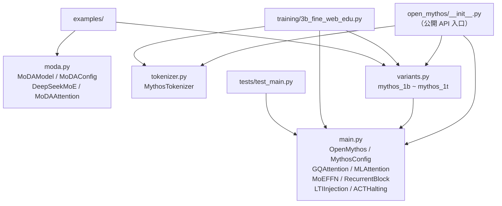
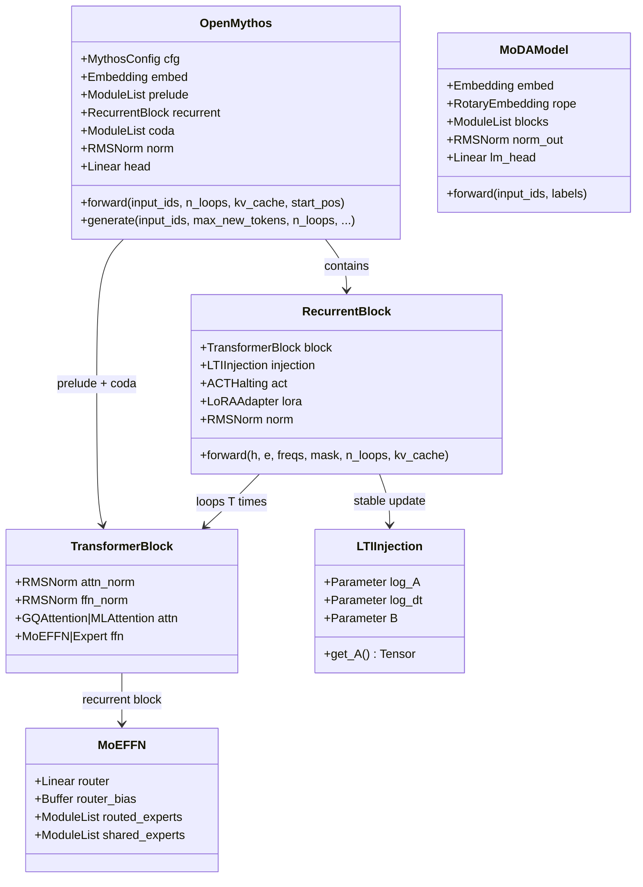

# OpenMythos 程式碼地圖

## Annotated Directory Tree

```
OpenMythos/
│
├── open_mythos/                  ← 主要套件（pip install 安裝的內容）
│   ├── __init__.py               ← 公開 API 入口；re-export 所有公開 class
│   ├── main.py                   ← 核心模型（1086 行）
│   │   ├── MythosConfig          ← 所有超參數的 dataclass
│   │   ├── RMSNorm               ← Root Mean Square Layer Normalization
│   │   ├── precompute_rope_freqs ← RoPE 頻率預計算（complex tensor）
│   │   ├── apply_rope            ← 套用 RoPE 到 Q/K
│   │   ├── GQAttention           ← Grouped Query Attention（+ Flash Attn 2）
│   │   ├── MLAttention           ← Multi-Latent Attention（DeepSeek-V2 風格）
│   │   ├── Expert                ← 單一 SwiGLU FFN（dense 和 routed expert 共用）
│   │   ├── MoEFFN                ← Mixture-of-Experts FFN（routed + shared）
│   │   ├── loop_index_embedding  ← 注入 sinusoidal loop-index 到 hidden state
│   │   ├── LoRAAdapter           ← 深度適應 LoRA（per-loop scale embedding）
│   │   ├── TransformerBlock      ← 標準 pre-norm block（attention + FFN）
│   │   ├── LTIInjection          ← 穩定注入 h_{t+1}=A·h+B·e+Trans（ρ(A)<1）
│   │   ├── ACTHalting            ← 自適應計算時間：per-position 停止機率
│   │   ├── RecurrentBlock        ← 核心 loop：單一 block 執行 T 次
│   │   └── OpenMythos            ← 頂層模型：Prelude → Recurrent → Coda
│   │
│   ├── moda.py                   ← 替代架構（738 行，獨立完整）
│   │   ├── MoDAConfig            ← MoDA 模型的設定 dataclass
│   │   ├── RMSNorm               ← 同 main.py 的 RMSNorm（重複定義）
│   │   ├── RotaryEmbedding       ← 帶 lazy cache 的 RoPE 模組（不同實作）
│   │   ├── DeepSeekExpert        ← SwiGLU expert（DeepSeek V3 命名）
│   │   ├── DeepSeekGate          ← 路由閘（支援 V3 bias routing + group routing）
│   │   ├── DeepSeekMoE           ← MoE 層（帶 expert-level balance loss）
│   │   ├── MoDAAttention         ← 跨層 depth KV attention（unified softmax）
│   │   ├── MoDABlock             ← 單一 transformer block（post-norm）
│   │   └── MoDAModel             ← 完整 decoder-only LM
│   │
│   ├── tokenizer.py              ← HuggingFace tokenizer 薄包裝
│   │   └── MythosTokenizer       ← encode/decode/vocab_size
│   │
│   └── variants.py               ← 7 個預設規格工廠函式
│       └── mythos_1b ~ mythos_1t ← 返回完整 MythosConfig
│
├── training/
│   ├── 3b_fine_web_edu.py        ← 完整預訓練腳本（單/多 GPU FSDP）
│   │   ├── FineWebEduDataset     ← 串流資料集（rank × worker shard）
│   │   ├── get_lr()              ← linear warmup → cosine decay
│   │   ├── save_checkpoint()     ← 原子寫入 + 自動保留最近 N 個
│   │   ├── load_checkpoint()     ← 恢復 model + optimizer state
│   │   └── main()                ← 訓練入口
│   └── requirements.txt          ← 訓練額外依賴（loguru 等）
│
├── tests/
│   ├── test_main.py              ← 主要單元測試（TestRMSNorm / RoPE / Attn / MoE...）
│   ├── test_rope_debug.py        ← RoPE 詳細正確性測試
│   ├── test_tokenizer.py         ← tokenizer 測試
│   ├── bench_vs_transformer.py   ← 與標準 Transformer 的性能對比
│   └── small_benchmark.py        ← 小型性能基準測試
│
├── examples/
│   ├── moda_example.py           ← MoDAModel 完整使用範例（含梯度驗證）
│   └── variants_example.py       ← 預設規格使用範例
│
├── docs/
│   ├── open_mythos.md            ← OpenMythos class 完整 API 文件（官方）
│   └── datasets.md               ← 訓練資料集推薦
│
├── README.md                     ← 主文件（架構理論 + 安裝 + 使用 + 引用）
├── pyproject.toml                ← Poetry 設定（依賴、版本、關鍵字）
├── requirements.txt              ← 基本依賴（非 Poetry 環境用）
└── example.py                    ← 頂層快速使用範例
```

---

## 「我想做 X，要看哪裡？」

| 我想要... | 看這裡 | 關鍵檔案 + 行號 |
|-----------|--------|----------------|
| 了解整體架構 | `README.md` Architecture 節 | `README.md:189` |
| 建立模型 | `OpenMythos.__init__` | `main.py:926` |
| 執行 forward pass | `OpenMythos.forward` | `main.py:992` |
| 自回歸生成文字 | `OpenMythos.generate` | `main.py:1036` |
| 修改模型超參數 | `MythosConfig` dataclass | `main.py:17` |
| 切換注意力實作（GQA/MLA） | `MythosConfig.attn_type` | `main.py:59` |
| 了解 recurrent loop 邏輯 | `RecurrentBlock.forward` | `main.py:825` |
| 了解穩定注入機制 | `LTIInjection.get_A()` | `main.py:714` |
| 了解 ACT 停止機制 | `RecurrentBlock.forward` ACT 部分 | `main.py:865` |
| 了解 MoE 路由 | `MoEFFN.forward` | `main.py:497` |
| 使用預設 3B 設定 | `mythos_3b()` | `variants.py:36` |
| 了解所有模型規格 | `variants.py` 全部 | `variants.py:1-198` |
| 使用 tokenizer | `MythosTokenizer` | `tokenizer.py:6` |
| 使用替代架構 MoDA | `MoDAModel` | `moda.py:922` |
| 理解 MoDA attention 邏輯 | `MoDAAttention.forward` | `moda.py:740` |
| 訓練 3B 模型 | `training/3b_fine_web_edu.py` | `main()` line 311 |
| 修改訓練超參數 | literal constants in `main()` | `3b_fine_web_edu.py:374` |
| 切換訓練資料集 | `dataset_subset` 變數 | `3b_fine_web_edu.py:386` |
| 執行測試 | `tests/test_main.py` | `pytest tests/` |
| 驗證 ρ(A) < 1 | `LTIInjection.get_A()` + test | `test_main.py:471` |

---

## 模組依賴關係圖



---

## 關鍵 Class 繼承關係


