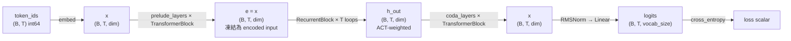
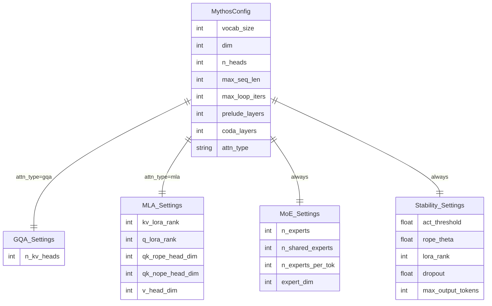

# OpenMythos 資料模型

## 1. 資料生命週期



---

## 2. Tensor 形狀字典

### 模型主流程

| 操作 | 輸入形狀 | 輸出形狀 | 說明 |
|------|---------|---------|------|
| `nn.Embedding` | `(B, T)` | `(B, T, dim)` | token → dense vector |
| `precompute_rope_freqs` | — | `(max_seq_len, dim//2)` complex64 | 預計算，存為 buffer |
| `_causal_mask` | — | `(1, 1, T, T)` | 上三角 -inf 遮罩 |
| `TransformerBlock` | `(B, T, dim)` | `(B, T, dim)` | 殘差連接保持形狀 |
| `RecurrentBlock` | `(B, T, dim)` h + `(B, T, dim)` e | `(B, T, dim)` | ACT 加權輸出 |
| `RMSNorm` | `(B, T, dim)` | `(B, T, dim)` | — |
| LM head `Linear` | `(B, T, dim)` | `(B, T, vocab_size)` | weight-tied with embed |

### GQAttention 內部（`main.py:212`）

| 步驟 | 形狀 |
|------|------|
| `wq(x)` → reshape | `(B, T, n_heads, head_dim)` |
| `wk(x)` → reshape | `(B, T, n_kv_heads, head_dim)` |
| `wv(x)` → reshape | `(B, T, n_kv_heads, head_dim)` |
| after `apply_rope` | 同上，形狀不變 |
| KV cache 追加後 | `(B, S, n_kv_heads, head_dim)`，S = 累積長度 |
| attention output | `(B, T, n_heads × head_dim)` |
| `wo(out)` | `(B, T, dim)` |

### MLAttention 內部（`main.py:357`）

| 步驟 | 形狀 |
|------|------|
| `q_down(x)` | `(B, T, q_lora_rank)` |
| `q_up_nope` | `(B, T, n_heads, qk_nope_head_dim)` |
| `q_up_rope` + RoPE | `(B, T, n_heads, qk_rope_head_dim)` |
| `q = cat(nope, rope)` | `(B, T, n_heads, qk_nope_dim + qk_rope_dim)` |
| `c_kv`（cached） | `(B, S, kv_lora_rank)` |
| `k_rope`（cached） | `(B, S, n_heads, qk_rope_head_dim)` |
| `kv_up` → split | k_nope: `(B, S, n_heads, qk_nope_dim)`；v: `(B, S, n_heads, v_head_dim)` |
| `wo(out)` | `(B, T, dim)` |

### MoEFFN 內部（`main.py:497`）

| 步驟 | 形狀 |
|------|------|
| `flat = x.view(-1, dim)` | `(B×T, dim)` |
| `router(flat)` logits | `(B×T, n_experts)` |
| `topk_idx` | `(B×T, n_experts_per_tok)` |
| `topk_scores` | `(B×T, n_experts_per_tok)` |
| routed output `out` | `(B×T, dim)` |
| shared expert output | `(B×T, dim)` |
| `out.view(B, T, dim)` | `(B, T, dim)` |

### RecurrentBlock 狀態演變（`main.py:825`）

| 時間點 | 變數 | 形狀 |
|--------|------|------|
| loop 開始 | `h` | `(B, T, dim)` |
| 每步 | `h_loop = loop_index_embedding(h, t, dim//8)` | `(B, T, dim)` |
| 每步 | `combined = RMSNorm(h_loop + e)` | `(B, T, dim)` |
| 每步 | `trans_out` | `(B, T, dim)` |
| 每步 | `lora(trans_out, t)` delta | `(B, T, dim)` |
| 每步 | `h = A·h + B·e + trans_out` (LTI) | `(B, T, dim)` |
| 每步 | `p = act(h)` halting prob | `(B, T)` |
| 累積 | `h_out += weight * h` | `(B, T, dim)` |

---

## 3. KV Cache 結構

KV cache 是一個 Python `dict`，key 為字串，value 為 per-layer 的 sub-dict。

### GQAttention cache（`main.py:243`）

```python
kv_cache["prelude_0"] = {
    "k": Tensor,   # (B, S, n_kv_heads, head_dim)
    "v": Tensor,   # (B, S, n_kv_heads, head_dim)
}
```

### MLAttention cache（`main.py:395`）

```python
kv_cache["prelude_0"] = {
    "c_kv":   Tensor,  # (B, S, kv_lora_rank)        ← 壓縮 KV latent
    "k_rope": Tensor,  # (B, S, n_heads, qk_rope_head_dim)  ← RoPE-encoded keys
}
# V 和 k_nope 每步從 c_kv 重建，不 cache
```

### Cache Key 命名規則

| 層 | Key 格式 | 範例 |
|----|---------|------|
| Prelude 第 i 層 | `f"prelude_{i}"` | `"prelude_0"`, `"prelude_1"` |
| Recurrent loop t | `f"recurrent_loop_{t}"` | `"recurrent_loop_0"` ... `"recurrent_loop_15"` |
| Coda 第 i 層 | `f"coda_{i}"` | `"coda_0"`, `"coda_1"` |

### KV Cache 記憶體對比（同等設定下）

| 方式 | 每 token 每層 cache 大小 | 備註 |
|------|------------------------|------|
| 標準 attention | `2 × n_heads × head_dim` | Q/K/V 完整 |
| GQA | `2 × n_kv_heads × head_dim` | 減少 `n_heads/n_kv_heads` 倍 |
| MLA | `kv_lora_rank + n_heads × qk_rope_head_dim` | 約比標準減少 10–20× |

---

## 4. MythosConfig 欄位分組



---

## 5. 模型規格對照表

| 函式 | dim | n_heads | Experts | loop_iters | max_seq_len | 預估參數 |
|------|-----|---------|---------|-----------|-------------|---------|
| `mythos_1b()` | 2048 | 16 | 64 routed + 2 shared | 16 | 4096 | ~1B |
| `mythos_3b()` | 3072 | 24 | 64 routed + 2 shared | 16 | 4096 | ~3B |
| `mythos_10b()` | 4096 | 32 | 128 routed + 2 shared | 24 | 8192 | ~10B |
| `mythos_50b()` | 6144 | 48 | 256 routed + 4 shared | 32 | 8192 | ~50B |
| `mythos_100b()` | 8192 | 64 | 256 routed + 4 shared | 32 | 1,000,000 | ~100B |
| `mythos_500b()` | 12288 | 96 | 512 routed + 8 shared | 48 | 1,000,000 | ~500B |
| `mythos_1t()` | 16384 | 128 | 512 routed + 8 shared | 64 | 1,000,000 | ~1T |

全部使用 `attn_type="mla"`；100B+ 使用 `vocab_size=100000`（其餘為 32000）。

---

## 6. MoDAConfig 欄位說明

**所在**：`moda.py:59`，供 `MoDAModel` 使用（獨立於 `MythosConfig`）

| 欄位 | 預設值 | 說明 |
|------|--------|------|
| `vocab_size` | 32000 | 詞彙表大小 |
| `d_model` | 2048 | hidden dimension（注意：與 MythosConfig 的 `dim` 對應） |
| `n_layers` | 24 | transformer 層數（MoDA 無 Prelude/Coda 分層，全部相同） |
| `n_heads_q` | 16 | query heads |
| `n_heads_kv` | 8 | KV heads（GQA） |
| `head_dim` | 128 | per-head dimension |
| `max_seq_len` | 4096 | 最大序列長度 |
| `rope_base` | 10000.0 | RoPE 基礎頻率（比 MythosConfig 的 500000.0 慢很多） |
| `n_shared_experts` | 2 | 共享 expert 數 |
| `n_routed_experts` | 64 | routed expert 池大小 |
| `n_activated_experts` | 6 | 每 token 選 top-K routed experts |
| `expert_hidden_dim` | 704 | 每個 expert 的 hidden dim |
| `moe_balance_alpha` | 0.001 | expert balance loss 權重（0 = 停用） |
| `moe_score_func` | `"softmax"` | `"softmax"`（V2 風格）或 `"sigmoid"`（V3 風格） |
| `moe_n_groups` | 1 | expert 分組數（1 = 停用 group routing） |
| `moe_topk_groups` | 1 | 每 token 最多路由到幾個 group |
| `moe_route_scale` | 1.0 | gate weight 縮放（DeepSeek-V3 用 2.5446） |

---

## 7. Checkpoint 資料結構

**儲存格式**（`training/3b_fine_web_edu.py:239`）：

```python
{
    "step": int,                    # 目前訓練 step
    "model": OrderedDict,           # model.state_dict()
    "optimizer": dict,              # optimizer.state_dict()
    "cfg": MythosConfig,            # 完整 config（pickle 序列化）
    "vocab_size": int,              # tokenizer vocab size（載入時校驗用）
}
```

**檔名格式**：`checkpoints/step_{N:07d}.pt`（7 位零填充）

**保留策略**：預設保留最近 3 個（`keep_last=3`），自動刪除舊 checkpoint。

**原子寫入**：先寫 `.tmp`，完成後 `os.replace()` → 避免寫到一半的 checkpoint 殘留。
