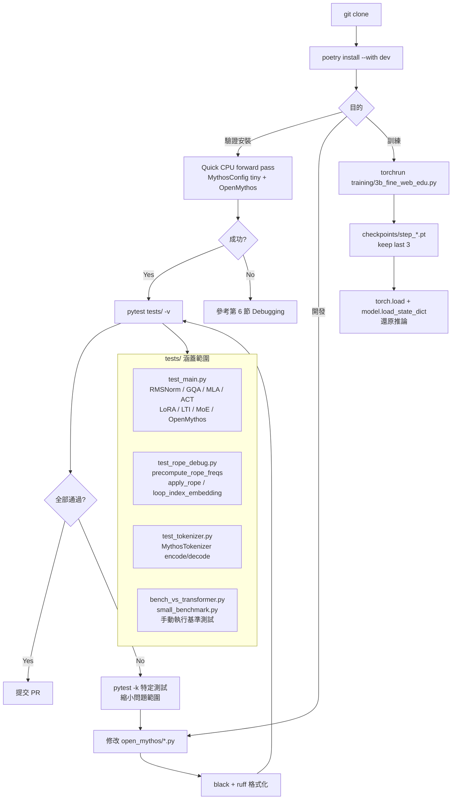

# OpenMythos 開發者上手指南

> **免責聲明**：OpenMythos 是社群驅動的推測性重建，不代表 Anthropic 任何官方實作或內部資訊。

---

## 1. Prerequisites

### Python 版本
```
Python >= 3.10, < 4.0
```

### GPU / CUDA 需求

| 使用情境 | 需求 |
|---------|------|
| 基本推論（GQA 小型模型） | 無 GPU，可純 CPU 執行 |
| MLA 或完整規格模型推論 | CUDA GPU 建議（VRAM ≥ 16 GB for 3B） |
| Flash Attention 2（選配） | CUDA >= 11.8，需 C++ build tools |
| 預訓練（3B FineWeb-Edu） | 多 GPU（FSDP），建議 ≥ 4× A100/H100 |

### 必要工具

```bash
# 確認版本
python --version        # >= 3.10
git --version
pip --version

# 選用（開發者建議安裝）
poetry --version        # >= 1.5
```

---

## 2. 環境建置

### 方式 1：pip 安裝（一般使用者）

```bash
pip install open-mythos
```

加裝 Flash Attention 2（選配，需 CUDA）：

```bash
# 先確認 CUDA toolkit 已安裝，再執行
pip install open-mythos[flash]
```

### 方式 2：開發者安裝（推薦）

```bash
# 1. clone 專案
git clone https://github.com/The-Swarm-Corporation/OpenMythos.git
cd OpenMythos

# 2a. 使用 Poetry（完整依賴隔離）
poetry install                    # 基本依賴
poetry install --with dev         # 加入 dev/lint/test 工具

# 2b. 或使用 pip（較輕量）
pip install -e .                  # 可編輯模式（editable install）
pip install pytest black ruff     # 手動補測試與 lint 工具
```

### 方式 3：訓練環境安裝

```bash
# 在開發者安裝基礎上，額外安裝訓練依賴
pip install -r training/requirements.txt
# 包含：torch>=2.11.0, datasets>=3.6.0, loguru>=0.7.3
```

---

## 3. 本地開發 Workflow

### 完整步驟（從 clone 到可用）

```bash
git clone https://github.com/The-Swarm-Corporation/OpenMythos.git
cd OpenMythos
poetry install --with dev
```

### 快速驗證安裝（小型 CPU forward pass）

```python
import torch
from open_mythos.main import OpenMythos, MythosConfig

# 建立最小測試配置（可在 CPU 跑完）
cfg = MythosConfig(
    vocab_size=200,
    dim=64,
    n_heads=4,
    n_kv_heads=2,
    max_seq_len=32,
    max_loop_iters=3,
    prelude_layers=1,
    coda_layers=1,
    attn_type="gqa",
    n_experts=4,
    n_shared_experts=1,
    n_experts_per_tok=2,
    expert_dim=16,
    lora_rank=4,
    kv_lora_rank=16,
    q_lora_rank=32,
    qk_rope_head_dim=8,
    qk_nope_head_dim=8,
    v_head_dim=8,
)

model = OpenMythos(cfg)
x = torch.randint(0, 200, (1, 8))
logits = model(x, n_loops=2)
print("forward pass OK, output shape:", logits.shape)
# 預期：torch.Size([1, 8, 200])
```

### 使用內建 variants（正式規格）

```python
from open_mythos.variants import mythos_1b, mythos_3b, mythos_10b
from open_mythos.main import OpenMythos

cfg = mythos_3b()
model = OpenMythos(cfg)
```

> **注意**：`mythos_7b()` 不存在，variants.py 直接從 3b 跳到 10b。

### MoDA 替代架構

```python
# MoDA 未從 open_mythos 頂層匯出，需直接 import
from open_mythos.moda import MoDAModel, MoDAConfig

cfg = MoDAConfig()
model = MoDAModel(cfg)
```

---

## 4. 測試策略

### 執行全部測試

```bash
# 在 repo 根目錄執行
pytest tests/ -v

# 含覆蓋率報告（需 pytest-cov）
pytest tests/ -v --cov=open_mythos --cov-report=term-missing
```

### 執行特定測試檔案

```bash
pytest tests/test_main.py -v            # 核心模型單元測試
pytest tests/test_rope_debug.py -v     # RoPE 位置編碼除錯
pytest tests/test_tokenizer.py -v      # tokenizer wrapper 測試
```

### 執行特定 test function

```bash
pytest tests/test_main.py::test_gqa_attention -v
pytest tests/test_main.py -k "mla" -v  # 只跑名稱含 mla 的測試
```

### 執行基準測試（非 pytest）

```bash
python tests/bench_vs_transformer.py   # 對比標準 Transformer
python tests/small_benchmark.py        # 小型性能基準
```

### 測試涵蓋元件

| 測試檔案 | 涵蓋元件 |
|---------|---------|
| `test_main.py` | `RMSNorm`, `GQAttention`, `MLAttention`, `ACTHalting`, `LoRAAdapter`, `LTIInjection`, `MoEFFN`, `Expert`, `RecurrentBlock`, `TransformerBlock`, `OpenMythos` 完整 forward |
| `test_rope_debug.py` | `precompute_rope_freqs`, `apply_rope`, `loop_index_embedding` |
| `test_tokenizer.py` | `MythosTokenizer` wrapper（encode/decode） |

---

## 5. 訓練環境建置

### 單 GPU 訓練

```bash
# 訓練腳本會自動偵測 RANK == -1（非分散式模式）
python training/3b_fine_web_edu.py
```

### 多 GPU 訓練（FSDP）

```bash
# 4 GPU 範例
torchrun --nproc_per_node=4 training/3b_fine_web_edu.py

# 多節點（8 GPU × 2 nodes）
torchrun \
  --nnodes=2 \
  --nproc_per_node=8 \
  --node_rank=0 \          # 第二個節點改為 1
  --master_addr=<HOST> \
  --master_port=29500 \
  training/3b_fine_web_edu.py
```

> **重要**：training 腳本的 docstring 說 DDP，但實際使用的是 **FSDP**（FullyShardedDataParallel），設定邏輯不同，不要混淆。

### FSDP 注意事項

- FSDP 會將模型參數分片到各 GPU，`world_size` 越大記憶體越省
- 訓練腳本會自動計算 `grad_accum = max(1, 256 // (world_size × micro_batch))` 以維持全域 batch size
- 若 GPU 數量改變，effective global batch token 數也會改變，需重新評估學習率

### 資料集下載與 Streaming

```python
# 訓練腳本內部設定（training/3b_fine_web_edu.py line ~385）
dataset_subset = "sample-10BT"   # 切換此變數換資料集
# 可用選項：HuggingFaceFW/fineweb-edu 的各 subset
```

資料集使用 HuggingFace `datasets` streaming 模式，無需完整下載即可訓練。首次執行時需要網路連線與 `HF_TOKEN`（若使用私有資料集）：

```bash
huggingface-cli login   # 設定 HF token（若需要）
```

### Checkpoint 管理

```
checkpoints/
└── step_0001000.pt     # 7 位零填充，字典序 = 時間序
└── step_0002000.pt
└── step_0003000.pt     # 預設保留最後 3 個
```

checkpoint 結構包含完整 `MythosConfig`，可直接還原：

```python
import torch
ckpt = torch.load("checkpoints/step_0003000.pt")
cfg  = ckpt["cfg"]      # MythosConfig object
step = ckpt["step"]
# model.load_state_dict(ckpt["model"])
```

保留策略預設 `keep_last=3`，可在訓練腳本中修改。

---

## 6. 常見踩坑與 Debugging 技巧

### Flash Attention 安裝失敗

```bash
# 症狀：pip install open-mythos[flash] 編譯失敗
# 原因：flash-attn 需要 CUDA toolkit + ninja + C++ build tools

# 解法：
sudo apt install ninja-build     # Ubuntu
pip install packaging ninja
pip install flash-attn --no-build-isolation

# 確認 CUDA 版本匹配
python -c "import torch; print(torch.version.cuda)"
nvcc --version
```

不安裝 flash-attn 也可正常使用，GQA 會自動 fallback 到標準 `F.scaled_dot_product_attention`。

### MLA 設定不相容錯誤

MLA 模式下有嚴格的維度限制：

```python
# 正確設定：需滿足以下條件
# head_dim = qk_nope_head_dim + qk_rope_head_dim
# n_heads × head_dim == dim  （不一定強制，但建議對齊）

# 錯誤範例（會在 forward 時 shape mismatch）
cfg = MythosConfig(
    dim=64, n_heads=4,
    qk_nope_head_dim=32, qk_rope_head_dim=32,  # head_dim = 64
    v_head_dim=64,
    kv_lora_rank=16, q_lora_rank=64,
    attn_type="mla",
    # ...
)
```

若出現 `RuntimeError: mat1 and mat2 shapes cannot be multiplied`，先確認 `kv_lora_rank` 和 `q_lora_rank` 是否與 `dim` 的比例合理。

### n_kv_heads 必須整除 n_heads

```python
# 正確
n_heads=8, n_kv_heads=4   # 8 % 4 == 0 ✓
n_heads=8, n_kv_heads=2   # 8 % 2 == 0 ✓

# 錯誤（會在 GQA expand 時 assert 失敗）
n_heads=8, n_kv_heads=3   # 8 % 3 != 0 ✗
```

### CUDA Out of Memory

```bash
# 推論時降低 batch 或序列長度
cfg.max_seq_len = 1024    # 預設 4096

# 訓練時：
# 1. 降低 micro_batch（training 腳本 literal 常數，需直接改程式碼）
# 2. 增加 grad_accum 補回 effective batch size
# 3. 使用更多 GPU 讓 FSDP 分片更細

# 快速診斷
python -c "import torch; print(torch.cuda.memory_summary())"
```

### 驗證 LTI 穩定性：ρ(A) < 1

Parcae 論文要求 spectral radius < 1 以保證訓練穩定：

```python
from open_mythos.main import LTIInjection, MythosConfig
import torch

cfg = MythosConfig(dim=256, ...)
lti = LTIInjection(cfg)

# 取出離散化後的 A 矩陣並計算 spectral radius
A = lti.A_discrete   # 或依實際屬性名稱
eigenvalues = torch.linalg.eigvals(A)
rho = eigenvalues.abs().max().item()
print(f"Spectral radius ρ(A) = {rho:.4f}")
assert rho < 1.0, f"不穩定！ρ(A) = {rho}"
```

### `load_tokenizer` 不存在的已知 Bug

```python
# 錯誤用法（__init__.py 匯出但函式未定義）
from open_mythos import load_tokenizer   # ImportError!

# 正確用法
from open_mythos.tokenizer import MythosTokenizer
tokenizer = MythosTokenizer("gpt2")     # 傳入 HF model name
```

同樣地，`get_vocab_size` 也是損壞的匯出，不要使用。

### start_pos 文件缺失

`forward()` 實際簽名為：

```python
def forward(
    self,
    input_ids: torch.Tensor,
    n_loops: int | None = None,
    kv_cache=None,
    start_pos: int = 0,          # ← 文件未記載！
) -> torch.Tensor:
```

`start_pos` 是 autoregressive decode 的關鍵參數，控制 KV cache 的寫入位置，使用時需明確傳入。

---

## 7. 關鍵設計限制速查

| 限制 | 說明 |
|-----|-----|
| `mythos_7b()` 不存在 | `variants.py` 規格：1b → 3b → **10b**，跳過 7b |
| `start_pos` 文件缺失 | README 與 `docs/open_mythos.md` 均未記載此參數 |
| MoDA 未從頂層匯出 | 需 `from open_mythos.moda import MoDAModel` |
| `load_tokenizer` 損壞 | `__init__.py:52` 匯出但函式本體不存在 |
| `get_vocab_size` 損壞 | 同上 |
| 訓練腳本超參數硬編碼 | `training/3b_fine_web_edu.py` 無 CLI，需直接改程式碼 |
| FSDP 非 DDP | docstring 描述有誤，實際使用 FSDP |
| `n_kv_heads` 需整除 `n_heads` | GQA expand 時 assert，違反會 runtime error |

---

## 8. 開發 Workflow 與測試架構



---

## 附錄：MythosConfig 快速參考

```python
from open_mythos.main import MythosConfig

# ── 最小 CPU 可用配置 ──
cfg = MythosConfig(
    vocab_size=200, dim=64, n_heads=4, n_kv_heads=2,
    max_seq_len=32, max_loop_iters=3,
    prelude_layers=1, coda_layers=1, attn_type="gqa",
    n_experts=4, n_shared_experts=1, n_experts_per_tok=2,
    expert_dim=16, lora_rank=4,
    kv_lora_rank=16, q_lora_rank=32,
    qk_rope_head_dim=8, qk_nope_head_dim=8, v_head_dim=8,
)

# ── 使用預設規格（推薦正式使用）──
from open_mythos.variants import mythos_1b, mythos_3b, mythos_10b
cfg = mythos_3b()            # 完整 3B 規格

# ── 常見欄位調整 ──
cfg.dropout = 0.1            # 預訓練時建議開啟
cfg.max_output_tokens = 2048 # 控制 generate() 最大長度
cfg.act_threshold = 0.95     # 調低 = 更積極提早停止 loop
```

---

*最後更新：2026-04-23 | 基於 OpenMythos v0.5.0*
