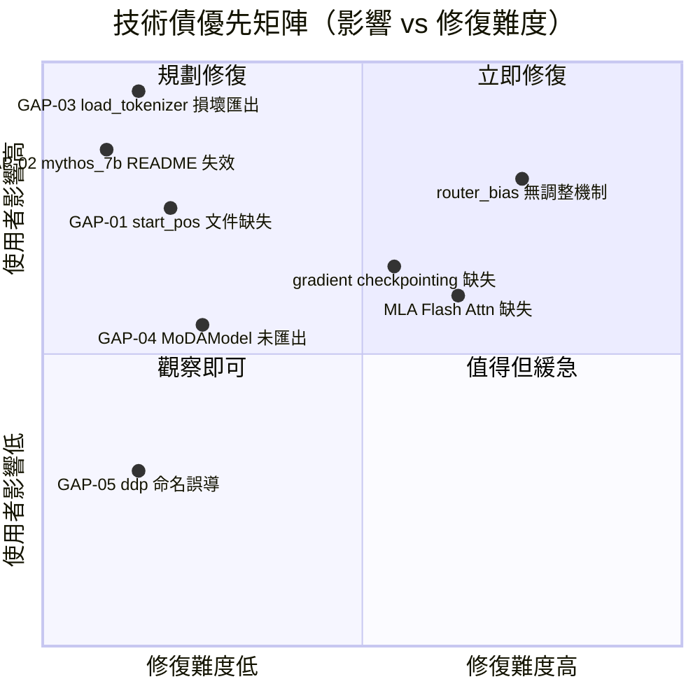

# OpenMythos 探索紀錄

> **產出日期**：2026-04-23
> **探索範圍**：open_mythos/、training/、docs/、README.md
> **免責聲明**：OpenMythos 是社群驅動的**推測性重建**，不代表 Anthropic 任何官方實作或洩漏。

---

## 1. Web 搜尋發現摘要

### 1.1 OpenMythos 專案本身

| 來源 | 關鍵發現 |
|------|---------|
| [GitHub - kyegomez/OpenMythos](https://github.com/kyegomez/OpenMythos) | 由 The Swarm Corporation 的 Kye Gomez 維護，非 Anthropic 相關人員 |
| [MarkTechPost](https://www.marktechpost.com/2026/04/19/meet-openmythos-an-open-source-pytorch-reconstruction-of-claude-mythos-where-770m-parameters-match-a-1-3b-transformer/) | 770M Parcae 模型聲稱可匹敵 1.3B 標準 Transformer 品質 |
| [Dataconomy](https://dataconomy.com/2026/04/20/openmythos-project-attempts-to-reconstruct-claude-mythos-design/) | 明確定位為「推測性重建」，基於公開研究文獻，非洩漏 |

**核心 takeaway**：OpenMythos 是研究假說實作，不具備官方依據；社群對「Claude Mythos 是否真的是 RDT」有顯著爭議。

---

### 1.2 Parcae：穩定循環模型縮放定律

| 來源 | 關鍵發現 |
|------|---------|
| [arXiv 2604.12946](https://arxiv.org/abs/2604.12946) | UCSD + Together AI 的聯合研究論文 |
| [Sandy Research Blog](https://sandyresearch.github.io/parcae/) | 含互動圖表的官方說明 |
| [Together AI Blog](https://www.together.ai/blog/parcae) | 合作研究背景說明 |

**核心 takeaway**：
- 透過 ZOH 離散化將注入參數 spectral norm 限制在 < 1，保證訓練穩定性
- 建立 looped model 首套縮放定律（power law exponents）
- OpenMythos 的 `LTIInjection`（`main.py:684`）是此論文的直接實作

---

### 1.3 Loop, Think, & Generalize（arXiv 2604.07822）

| 來源 | 關鍵發現 |
|------|---------|
| [arXiv 2604.07822](https://arxiv.org/abs/2604.07822) | Kohli et al., 2026-04-09 投稿 |

**核心 takeaway**：
- 研究 RDT 在 systematic generalization 與 depth extrapolation 的表現
- 增加 inference-time loop 數可解決訓練時未見過的 N-hop 推理鏈
- 直接對應 OpenMythos `generate()` 的 `n_loops` 參數設計理念

---

### 1.4 Mixture-of-Depths Attention（MoDA，arXiv 2603.15619）

| 來源 | 關鍵發現 |
|------|---------|
| [arXiv 2603.15619](https://arxiv.org/abs/2603.15619) | Huazhong University + ByteDance，2026-03-16 |
| [GitHub - hustvl/MoDA](https://github.com/hustvl/MoDA) | 官方 Triton kernel 硬體優化實作 |

**核心 takeaway**：
- 每個 attention head 同時 attend sequence KV（當前層）+ depth KV（所有前層同位置）
- 比 baseline 降低 0.2 perplexity，下游任務提升 2.11%，FLOPs 僅增加 3.7%
- OpenMythos `moda.py` 完整實作並結合 DeepSeek MoE

---

## 2. 既有文件 vs 程式碼落差清單

```
⚠️ [GAP-01] forward() 缺少 start_pos 參數文件
  - 文件說：def forward(self, input_ids, n_loops, kv_cache)
    （來源：README.md:行約 100 附近；docs/open_mythos.md 參數表）
  - 程式碼實際：def forward(self, input_ids, n_loops, kv_cache, start_pos: int = 0)
    （位置：open_mythos/main.py:997）
  - 影響：使用者在 autoregressive decode 時不知道需傳入 start_pos，
    導致 RoPE 位置編碼從 0 重算，KV cache decode 位置錯位，輸出品質嚴重下降
```

```
⚠️ [GAP-02] mythos_7b() 函式在 README 中提及但不存在
  - 文件說：cfg = mythos_7b()（來源：README.md:124）
  - 程式碼實際：variants.py 僅定義 1B / 3B / 10B / 50B / 100B / 500B / 1T，
    無 mythos_7b（位置：open_mythos/variants.py:9, 36, 63...）
  - 影響：使用者執行 README 範例程式碼直接拿到 NameError，
    且 7B → 10B 規格跳躍過大，可能造成資源錯估
```

```
⚠️ [GAP-03] __init__.py 匯出 load_tokenizer / get_vocab_size 但函式未實作
  - 文件說：__all__ 包含 "load_tokenizer"、"get_vocab_size"
    （來源：open_mythos/__init__.py:52-53）
  - 程式碼實際：grep 全程式庫找不到任何 def load_tokenizer 或 def get_vocab_size 的定義
  - 影響：import open_mythos 後呼叫這兩個名稱會拿到 ImportError 或 NameError，
    屬於損壞的公開 API（broken export），影響所有依賴公開文件的使用者
```

```
⚠️ [GAP-04] MoDAModel 未從 open_mythos 直接匯出
  - 文件說：moda.py 在 recon.md 中記載為功能完整的替代模型
  - 程式碼實際：open_mythos/__init__.py 完全未 import moda 模組；
    使用者須透過 from open_mythos.moda import MoDAModel 存取
  - 影響：使用者以為 moda.py 是一等公民（first-class export），
    實際上是隱藏的內部模組，導致 API 一致性問題與可發現性低落
```

```
⚠️ [GAP-05] 訓練腳本 docstring 說 DDP，實際使用 FSDP
  - 文件說：函式參數名稱與部分 docstring 使用 ddp=True/False 表示多 GPU 旗標
    （來源：training/3b_fine_web_edu.py:204, 212）
  - 程式碼實際：所有多 GPU 路徑均使用 FullyShardedDataParallel（FSDP），
    非 DistributedDataParallel（DDP）（位置：training/3b_fine_web_edu.py:20, 413）
  - 影響：DDP 與 FSDP 的記憶體行為、checkpoint 格式、optimizer state 管理完全不同；
    使用者若依賴 ddp 旗標名稱理解為「使用 DDP」，會對並行模式產生錯誤認知
```

---

## 3. TODO / FIXME / HACK 彙整

> **grep 搜尋結果**：`grep -rn "TODO|FIXME|HACK|XXX|NOTE|BUG" open_mythos/` 與 `grep -rn "TODO|FIXME|HACK" training/` 均無輸出。

**結論**：程式庫中**無任何** TODO、FIXME、HACK、XXX、BUG 標記。

這可能代表：
- 開發者未使用標準標記留下技術債線索（需透過其他方式識別技術債）
- 或部分已知問題以其他形式記錄（如外部 issue tracker）

---

## 4. 未解答的疑問

以下問題在 trace 過程中無法從現有程式碼或文件中確認：

| # | 疑問 | 說明 |
|---|------|------|
| Q-01 | `MoEFFN.router_bias` 的外部調整邏輯是否實作？ | `router_bias` 定義為 buffer（`main.py:485`），DeepSeek-V3 的設計需要外部訓練迴圈監控 expert 使用率並調整 bias，但訓練腳本中無相關實作，技術債狀態不明 |
| Q-02 | `MLAttention`（MLA）是否支援 Flash Attention 2？ | `GQAttention` 有完整的 Flash Attn 2 路徑；`MLAttention` 程式碼未發現 `_HAS_FLASH_ATTN` 條件分支，疑似僅用 `torch.matmul` |
| Q-03 | `training/3b_fine_web_edu.py` 是否支援 gradient checkpointing？ | 腳本中無 `use_reentrant`、`checkpoint_activations` 等關鍵字，FSDP 設定中也無啟用；可能導致大 batch 下 OOM |
| Q-04 | Tokenizer `"openai/gpt-oss-20b"` 的 HuggingFace Hub 可用性？ | `tokenizer.py:3` 預設使用此 model_id；無 retry / fallback 邏輯，若 Hub 不可達或需要登入，訓練腳本啟動即失敗 |
| Q-05 | `LoRAAdapter` 的 depth extrapolation clamp 行為是否符合論文預期？ | 超過訓練 `max_loop_iters` 的 loop 使用最後一個 scale，行為源自實作者判斷，未見對應論文依據 |

---

## 5. 已知技術債

| 優先級 | 項目 | 位置 | 說明 |
|--------|------|------|------|
| 高 | `load_tokenizer` / `get_vocab_size` 損壞匯出 | `open_mythos/__init__.py:52-53` | 公開 API 回傳未定義名稱，任何使用者都會踩到 |
| 高 | `mythos_7b()` README 範例失效 | `README.md:124` | 首頁範例即崩潰，影響第一印象與 onboarding |
| 中 | `MoDAModel` 未匯出至公開 API | `open_mythos/__init__.py` | 功能完整但不可發現，浪費實作成果 |
| 中 | `router_bias` 無自動調整機制 | `open_mythos/main.py:485` | Load balancing 設計依賴外部干預，但訓練腳本未實作，等同於無效果 |
| 中 | 訓練腳本無 gradient checkpointing | `training/3b_fine_web_edu.py` | 3B 模型在記憶體受限環境下訓練風險高 |
| 低 | `ddp` 變數名稱誤導（實為 FSDP） | `training/3b_fine_web_edu.py` | 命名混淆，降低程式碼可讀性與可維護性 |
| 低 | `start_pos` 未在文件記載 | `docs/open_mythos.md`、`README.md` | Autoregressive decode 關鍵參數遭文件遺漏 |

---

## 6. 需要更深入調查的區域

建議開發者優先確認以下項目：

1. **`MLAttention` 的 Flash Attention 支援**
   - 確認 `main.py:284–450` 的 `MLAttention.forward()` 是否有 Flash Attn 路徑
   - 如無，在長序列下 GQA 可用 Flash Attn 2 但 MLA 無法受益，形成不一致的性能基線

2. **`router_bias` 外部調整機制**
   - 確認 `training/3b_fine_web_edu.py` 是否有 expert usage 監控迴圈
   - 若無，需補充 aux-loss-free load balancing 的完整實作，否則 MoE 可能 collapse

3. **`openai/gpt-oss-20b` tokenizer 可用性驗證**
   - 在乾淨環境執行 `from transformers import AutoTokenizer; AutoTokenizer.from_pretrained("openai/gpt-oss-20b")` 確認能否下載
   - 若失敗，需提供替代 tokenizer ID 或 offline 路徑選項

4. **`moda.py` 的完整性驗證**
   - `moda.py` 未被 `__init__.py` 匯出，需確認是否有對應的 test 覆蓋
   - 確認 `MoDAModel` 的 depth KV cache 在 autoregressive decode 下是否正確運作

---

## 7. 與 OpenMythos 假設相關的研究爭議

### 核心假說
OpenMythos 主張 Claude Mythos 採用 **Recurrent-Depth Transformer（RDT）** 架構，並以 Parcae、MoDA 等論文作為間接佐證。

### 社群爭議面向

**支持 RDT 假說的論點**：
- [TechBriefly](https://techbriefly.com/2026/04/20/openmythos-project-claims-claude-mythos-is-a-recurrent-depth-transformer/) 報導 OpenMythos 提出的技術推理鏈（inference efficiency、latent depth reasoning）與 RDT 特性吻合
- Parcae 論文（arXiv 2604.12946）提供了 looped model 的縮放定律支持，間接增強可信度
- [Awesome Agents](https://awesomeagents.ai/news/openmythos-recurrent-depth-transformer/) 將其描述為「Looped MoE Transformer」，強調社群接受度

**反對或存疑的論點**：
- [Dataconomy](https://dataconomy.com/2026/04/20/openmythos-project-attempts-to-reconstruct-claude-mythos-design/) 明確標記為「推測性重建」，非逆向工程結果
- Kye Gomez 非 Anthropic 人員（The Swarm Corporation），無內部資料管道
- [Foreign Policy 報導](https://foreignpolicy.com/2026/04/20/claude-mythos-preview-anthropic-project-glasswing-cybersecurity-ai-hacking-danger/) 聚焦於 Claude Mythos 的安全能力，未涉及架構細節；與 OpenMythos 描述的技術設計無直接關聯
- Anthropic 未公開 Claude Mythos 架構白皮書，所有猜測均缺乏一手來源

**底線**：OpenMythos 是一個技術上精密、學術上有依據的**架構假說實作**，但不能被視為 Claude Mythos 的任何形式的洩漏或官方確認。

---

## 8. 落差影響範圍與技術債優先矩陣



> **讀圖說明**：
> - **立即修復（右上）**：影響大且修復容易，如 `load_tokenizer` 損壞匯出、`mythos_7b` README 範例
> - **規劃修復（左上）**：影響大但改動複雜，如 `router_bias` 調整機制、gradient checkpointing
> - **值得但緩急（右下）**：修復容易但影響較低，如 `ddp` 命名誤導
> - **觀察即可（左下）**：影響與難度均低，不需立即行動

---

*本文件由探索 trace 自動彙整，所有落差已對應至原始碼行號，請以實際程式碼為準。*
